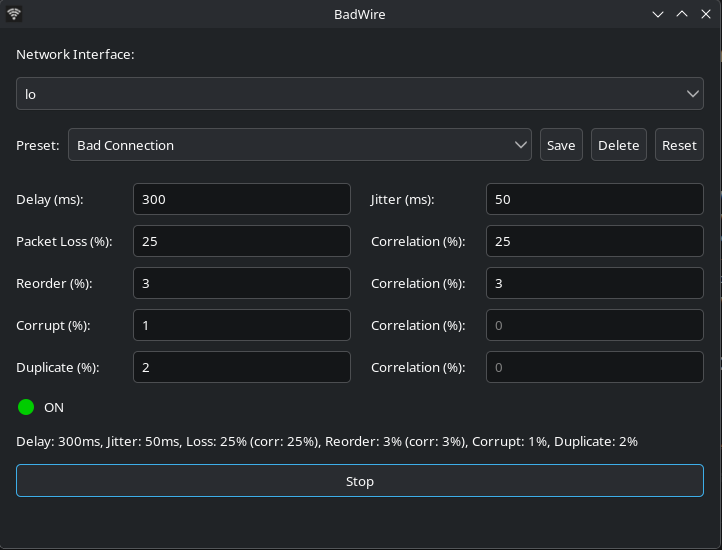

# BadWire
BadWire is a **simple GUI for simulating network problems** with `tc-netem`.

## Features
- Clean GTK 3 interface
- Full control over `netem` parameters:
    - Delay & jitter (automatic unit handling)
    - Packet loss, corruption, duplication, and reordering (all with configurable correlation)
- Built-in presets: Wi‑Fi, Bad Network, 100% Loss, and more
- Save and manage your own custom presets
- Instant on/off switching for any network interface
- Runs as a normal user – password is requested **only once** for `tc` (PolicyKit helper)

## Screenshot

## Usage
- Launch **BadWire** from your application menu or run `badwire` in a terminal.
- Select a network interface from the drop‑down list.
- Adjust parameters manually or pick a preset.
- Press **Start** – a single password prompt appears (if required by PolicyKit).
- Press **Stop** to restore normal network behaviour.
- Closing the window automatically removes all active rules.

## Installation

### Debian / Ubuntu

Download the latest .deb from Releases and run:
~~~ bash
sudo dpkg -i badwire_1.0.0_amd64.deb
~~~

### Arch
Download PKGBUILD
~~~bash
makepgk -si
~~~

### From Source
Build dependencies: rustc, cargo, gtk3-devel.
~~~bash
git clone https://github.com/your-org/badwire.git
cd badwire
cargo build --release
sudo ./target/release/BadWire
~~~
You can build everything (.tar.gz, .deb, and update PKGBUILD) with script: scripts/build-all.sh

## AI Disclosure
This project used AI-assisted development.
- **In building**: AI was used for code generation, refactoring, and test creation.
- **In execution**: The project does not use AI at runtime.

## License
GPL-3.0. [LICENSE](LICENSE).

